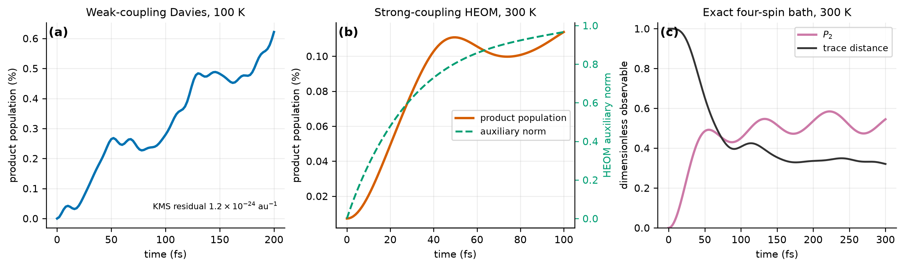
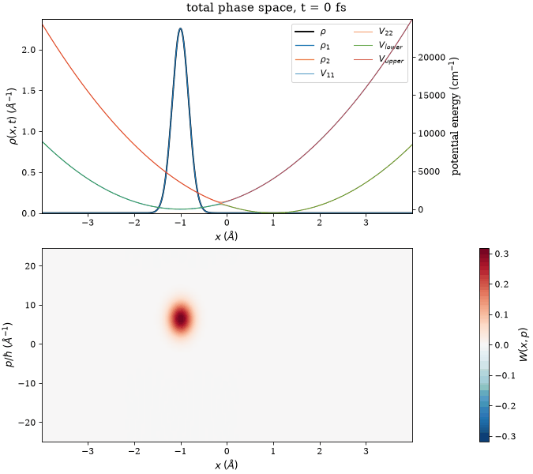

# QuantumDynamics

Quantum dynamics for H-atom transfer between two coupled diabatic potential
wells. One-, two-, and three-coordinate wavepackets propagate with FFT
split-operator methods; reduced density matrices support weak-coupling Davies,
strong-coupling HEOM, and exact finite spin-bath dynamics.
Reactant and product wells support stochastic coordinate-shift, curvature, and
enthalpy modulation with independent or correlated noise. A Markovian or
Lorentz-colored Langevin/GLE bath thermostats the nuclear wavepacket centroid
using classical fluctuation-dissipation statistics. `damp_reactant` and
`damp_product` select which diabatic state receives momentum damping; enabling
both retains shared-centroid behavior.

## Illustrative results



*Representative method-specific validation calculations: weak-coupling Davies
dynamics with KMS detailed balance (left), strong-coupling Drude-Lorentz HEOM
with active auxiliary-density memory (center), and exact four-spin-bath dynamics
with trace-distance backflow (right). Temperatures and time windows differ; this
figure demonstrates solver capabilities, not a like-for-like physical benchmark.*



*Product-damped H-transfer trajectory shown as coordinate density over diabatic
and adiabatic potential surfaces (top) and total nuclear Wigner function (bottom).
Red/blue phase-space lobes expose positive/negative quantum interference that a
coordinate-density plot alone cannot show. Animation is illustrative and remains
conditional on this trajectory's Hamiltonian, bath, and grid.*

Additional illustrated results for multidimensional propagation, biexponential
kinetics, and controlled mechanism tests appear in the
[framework notes](docs/QuantumDynamics_Framework_Notes.pdf).

Input from `INPUT.nml` uses chemistry-facing units: lengths in angstrom, times
in femtoseconds, energies/couplings in cm^-1, rates in fs^-1, temperature in
kelvin, mass in u/amu, and wave numbers in 1/angstrom. Parser validates these
values and converts them to atomic units immediately. ASCII and HDF5 writers
convert coordinates, time, wavefunctions/densities, expectation values, and
potentials back to physical units.

Quartic inputs `c4_1` and `c4_2` use cm^-1/angstrom^4. Energy shifts remain
independent cm^-1 values; they are no longer overloaded as quartic coefficients.
`k1` and `k2` define well stiffness; obsolete no-op `w0` input was removed.

`temperature_k` and `mass_amu` are physical inputs. `beta` and atomic-unit mass
are derived internally and must not appear in `INPUT.nml`. This replaces old
internal-unit `beta` input and fixed electron-mass propagation.

Build with `make`; disable HDF5 support with `make USE_HDF5=0`. Run with
`./qle_1d [INPUT.nml]`; `--help` never starts a simulation. At runtime,
`hdf5=.false.` selects ASCII output even in HDF5-enabled builds. Run unit,
FFTW, Langevin, and output smoke tests with `make test`.

`write_initial=.true.` records an exact `t=0` frame. Optional smooth edge
absorption uses `use_absorber`, `absorber_width` (angstrom), `absorber_rate`
(fs^-1), and `absorber_power`; absorbed norm represents outgoing flux.

Random streams depend on trajectory number, not MPI rank, so changing rank
count does not change a trajectory's stochastic sequence. Static ASCII PES
uses `*.pes.dat`; stochastic PES snapshots use `*.sNNNNNN.pes.dat`.

Aggregate MPI/rank trajectory files with `analyze_ensemble.py`. It writes
population means/SEM and optionally bounded mono-/biexponential fits with
trajectory-bootstrap rate intervals.

HDF5 writes static potential surfaces only in first frame; stochastic surfaces
remain frame-resolved. `ShowDyn.py` reuses single stored static surface for all frames.

## Wigner phase space and wavepacket movies

`ShowDyn.py` computes the signed Wigner representation directly from saved complex
wavefunctions. Position is reported in angstrom and momentum as `p/hbar` in inverse
angstrom. `total` traces over diabatic electronic state; `state1` and `state2` give
component-resolved diagnostics. Default 256-point analysis grid limits quadratic
phase-space cost while preserving wavepacket norm.

```sh
# Static density/PES and Wigner figure
python ShowDyn.py run.traj000001.rank0.h5 --no-usetex \
  --wigner --snapshot 20 --pmax 30 --save-figure wigner.png

# Animated density/PES and Wigner phase space
python ShowDyn.py run.traj000001.rank0.h5 --no-usetex \
  --wigner --animate --every 5 --pmax 30 \
  --save-animation wigner.mp4 --fps 20

# Density and potential-surface movie without phase space
python ShowDyn.py run.traj000001.rank0.h5 --no-usetex \
  --animate --every 5 --save-animation density_pes.mp4 --fps 20
```

MP4, M4V, and MOV output uses H.264 (`libx264`), 8-bit `yuv420p`, and a
fast-start index for QuickTime compatibility. This requires `ffmpeg`. GIF output
uses Pillow and remains available by choosing a `.gif` filename.

Negative Wigner values diagnose nonclassical coherence; Wigner function is a
quasiprobability, not an ordinary probability distribution. Increase
`--wigner-points` only after checking grid convergence.

## Checkpoint/restart

Set `checkpoint_every` to a positive step count. Each trajectory gets an atomically
replaced, schema-versioned HDF5 checkpoint containing both wavefunctions, intrinsic
Fortran RNG state, Langevin auxiliary memory, stochastic-potential state, time, and
output indices. Resume with the same grid and time step using
`restart_from_checkpoint=.true.`; `nsteps` is the desired final step. Regression
tests require bitwise identity with uninterrupted propagation. Deterministic
`FFTW_ESTIMATE` plans make restart results reproducible under the same numerical stack.

## Parallel single-file HDF5

True MPI-IO output requires Parallel HDF5:

```sh
make USE_PARALLEL_HDF5=1 HDF5_PREFIX="$(brew --prefix hdf5-mpi)"
make test-parallel
```

Set `parallel_hdf5=.true.`. All MPI ranks write nonoverlapping trajectory/frame
hyperslabs to `PREFIX.ensemble.h5`; no rank-local trajectory files are produced.
`analyze_ensemble.py` reads both legacy per-trajectory files and this ensemble layout.
Checkpoint restart remains a per-trajectory-file mode so crash recovery never depends
on partially committed collective metadata.

## Quantum bath and density matrices

`quantum_fdt_density.py` propagates the complete finite-grid reduced density matrix
with a completely positive secular Davies generator. Drude-Ohmic absorption and
emission rates satisfy the KMS quantum detailed-balance relation at every resolved
Bohr frequency and converge to the Gibbs state. This is the controlled weak-coupling,
Markovian quantum-FDT model; the Langevin executable remains the classical-FDT
centroid model.

```sh
python quantum_fdt_density.py --temperature 100 --gamma 0.02 \
  --cutoff 0.2 --duration 200 --output quantum_density.h5
```

`heom_nonmarkovian.py` covers strong-coupling, finite-memory physics for a harmonic
Gaussian Drude-Lorentz bath. It propagates a scaled hierarchy of auxiliary density
operators with one Drude and configurable Matsubara poles, plus a residual white-tail
terminator. No Born, Markov, or secular approximation is made. Physical controls use
K, cm^-1, fs^-1, and fs; HDF5 output includes the reduced density matrix, coordinate
densities, populations, bath decomposition, and ADO-memory norm.

```sh
python heom_nonmarkovian.py --reorganization 500 --cutoff 0.04 \
  --depth 4 --matsubara 2 --duration 100 --output heom_nonmarkovian.h5
python heom_convergence.py --depth 3 --matsubara 2 --tolerance 0.02
```

HEOM is systematically converged in hierarchy depth, bath-pole count, and retained
system states. `--initial-preparation correlated-equilibrium` solves the stationary
truncated hierarchy with unit trace; `correlated-projected` applies the system
preparation operator to every equilibrium ADO. These retain equilibrium system-bath
correlations and provide the real-time stationary counterpart of imaginary-time HEOM
initialization. Low temperatures require more Matsubara poles; the supplied 10 K
validation uses eight poles and checks a ninth.

`spin_bath_non_gaussian.py` covers a distinct non-Gaussian model family by exact
diagonalization of a reactant/product two-state system coupled to a finite thermal
spin bath. It writes the full reduced density matrix, populations, trace distance,
and information-backflow measure. Cost grows exponentially, so the implementation
is deliberately limited to ten bath spins.

## Multidimensional transfer

`multidimensional_transfer.py` supplies a two-coordinate, two-diabatic-state FFT
split-operator solver. Coordinate one is H transfer; coordinate two is a coupled
promoting/bath mode with independent mass, shifted wells, and reaction-path coupling.
It writes physical-unit 2D densities, surfaces, populations, and time to HDF5.

`multidimensional_transfer_3d.py` extends this construction to one transfer and two
promoting coordinates. It accepts either analytic coupled valleys or a validated
external diabatic PES through `potential_data.py`. The PES schema stores strictly
increasing x/y/z axes in angstrom and Hermitian V11/V22/V12 surfaces in cm^-1;
trilinear interpolation and atomic-unit conversion occur at the solver boundary.
See [`docs/PES_SCHEMA.md`](docs/PES_SCHEMA.md) for the exact dataset contract.
Electronic-structure surface generation remains external—this repository consumes,
validates, and propagates first-principles data but is not an electronic-structure code.

## Automated evidence campaigns

`convergence_campaign.py` runs time-step, grid, box, absorber, and ensemble-size
variants and writes machine-readable and Markdown pass/fail summaries.

`heom_convergence.py` independently checks hierarchy depth, Matsubara-pole count,
system-basis truncation, trace, Hermiticity, and positivity.

`mechanism_attribution.py` preregisters coupling-off, sub-barrier H, sub-barrier D,
and over-barrier controls. It reports classical Wigner above-barrier fractions,
isotope suppression, prompt transfer, bounded rates, SEM, and coupling background.
Mechanism labels are issued only when all evidence thresholds pass; otherwise result
is explicitly inconclusive.
